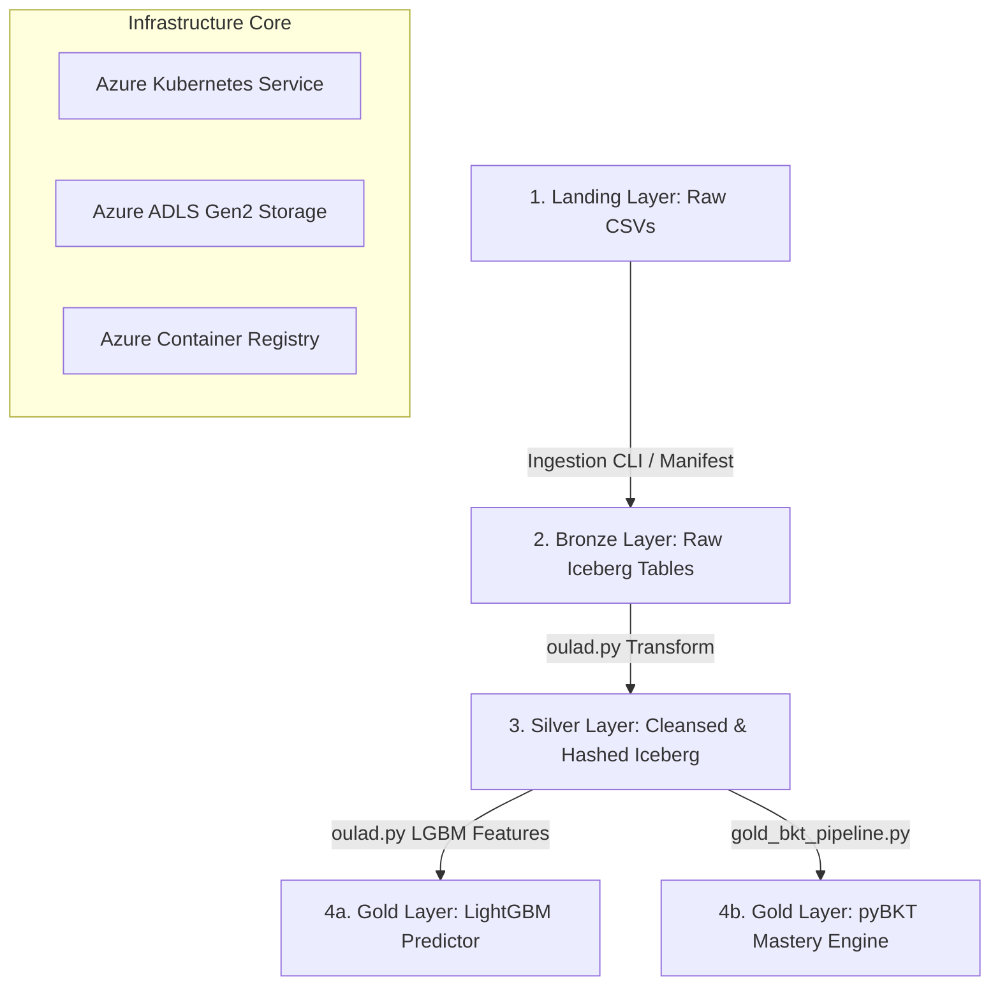

# B-Learn Medallion Architecture: End-to-End Technical Documentation

This document provides a comprehensive system-level overview of the B-Learn data platform. It outlines the Medallion architecture (Bronze, Silver, Gold), including data modeling, ingestion, cleaning, ML pipelines (LightGBM & pyBKT), and infrastructure orchestration on AKS (Azure Kubernetes Service).

---

## 1. System Architecture & Overview

B-Learn processes massive educational datasets (such as EdNet, OULAD, and SED) through a three-tier medallion architecture stored in **Apache Iceberg** format on **Azure ADLS Gen2** and orchestrated via **Apache Spark** running on **AKS**.



---

## 2. Ingestion & Bronze Layer (Raw Tables)

The Bronze layer ingests and tracks raw files as queryable tables while preserving metadata.

### A. Manifest-Driven Ingestion
To ingest large datasets (e.g. EdNet with 1.7M+ small files) reliably, B-Learn utilizes a manifest file (`full_data_manifest.json`):
1. **Discover**: Scans raw data and records source path, row counts, and table destination details.
2. **Ingest**: Spawns a PySpark instance that reads source paths and writes to Iceberg tables.
3. **Verify**: Compares source row counts against destination table counts to guarantee `100% data integrity`.

### B. EdNet Consolidation
To solve the **small files problem** in HDFS/Blob storage, EdNet CSVs are consolidated before ingestion:
```bash
python -m data_pipeline.ingestion.ingest consolidate-ednet \
  --ednet-source-root large-data/EdNet \
  --consolidated-root infra/staging/ednet_consolidated_full_compacted \
  --target-partitions 10
```
This merges millions of tiny student event CSVs into compact, partitioned Parquet groups, reducing metadata overhead by 99%.

---

## 3. Cleansing & Silver Layer (Enriched & Pseudonymized)

The Silver layer transforms raw Bronze tables into clean, standardized, and secure schemas. 

* **File Location**: [data_pipeline/silver/oulad.py](file:///Users/trandinhquangminh/Codespace/b-learn/data_pipeline/silver/oulad.py)
* **Execution**: `make silver-oulad-transform`

### Transformations Implemented:
1. **String Trimming**: Cleans trailing/leading whitespaces from categorical fields.
2. **Explicit Type Casting**: Forces columns into strict integers/doubles (e.g. `score`, `weight`, `date_submitted`).
3. **Anonymization & Compliance (Student ID Hashing)**:
   Student IDs (`id_student`) are hashed using **SHA-256** with PySpark's `sha2()` function before leaving the Bronze boundary. This protects student identity in downstream analytical environments:
   ```python
   df = df.withColumn("id_student", F.sha2(F.col("id_student").cast("string"), 256))
   ```
4. **Deduplication**: Drops duplicate records using `.dropDuplicates()`.
5. **Metadata Enrichment**: Injects tracking fields:
   - `_silver_at`: Timestamp of transformation.
   - `_silver_source_table`: Source table name.
6. **Partition Strategy**: Partitions Iceberg tables by `code_module` (course) to speed up course-specific query execution.

---

## 4. Gold Layer: LightGBM Student-at-Risk Engine

The Gold layer structures business features and trains predictive machine learning models. The LightGBM pipeline identifies students at risk of failing or withdrawing early.

* **File Location**: [data_pipeline/gold/oulad.py](file:///Users/trandinhquangminh/Codespace/b-learn/data_pipeline/gold/oulad.py)
* **Execution**: `make gold-oulad-train`

### A. Feature Engineering (As of Cutoff Day)
Features are calculated strictly up to a configurable `CUTOFF_DAY` (default: 25 days into the term) to prevent data leakage and enable early prediction:

#### Virtual Learning Environment (VLE) Engagement Features:
* `total_clicks`: Total interaction counts.
* `active_days`: Distinct days the student logged in.
* `avg_daily_clicks`: Average clicks per session.
* `max_clicks_day`: Peak daily engagement.
* `engagement_span`: Days elapsed between first and last activity.
* `recent_weekly_rate`: Clicks in the 7 days prior to the cutoff.
* `recency_days`: Days elapsed since the last VLE log.
* `engagement_momentum`: `recent_weekly_rate` minus `avg_daily_clicks` (captures if engagement is fading or spiking).

#### Assessment Performance Features:
* `avg_score` & `min_score`: Student performance scores up to the cutoff.
* `submission_count`: Total assignments submitted.
* `late_submissions`: Sum of banked/late submissions.
* `weighted_avg`: Score weighted by assignment weight:
  $$\text{Weighted Avg} = \frac{\sum (\text{score} \times \text{weight})}{\sum \text{weight}}$$

#### Demographics & Registration:
* Categorical values (e.g. `region`, `imd_band`, `highest_education`, `age_band`) are ordinal encoded. Missing fields default to `"Unknown"`.

### B. Machine Learning Modeling
* **Model**: `LGBMClassifier` (Multiclass: Success, Fail, Withdrawn).
* **Train/Test Splitting Strategy**: Uses a **temporal split** by default. Data from school terms prior to 2014 is used for training, while terms starting in 2014 are held out for testing. This mimics actual deployment scenario where models predict on future semesters.
* **Pre-processing Pipeline**: Uses `ColumnTransformer` with `SimpleImputer` (median for numeric, most frequent for categorical) and `OrdinalEncoder`.
* **Training Safety**: Incorporates early stopping (`stopping_rounds=100`) monitoring logloss on a validation split to prevent overfitting.
* **Deployment & Artifact Registry**:
  Saves risk probabilities to `gold_catalog.gold_db.oulad_at_risk_predictions` and uploads the trained Scikit-learn Pipeline (`oulad_lgbm_pipeline.joblib`) and classification metrics directly to the `gold` Azure Blob Storage container.

---

## 5. Gold Layer: pyBKT Student Mastery Engine

The BKT pipeline models student knowledge growth sequentially using a Hidden Markov Model.

* **File Location**: [data_pipeline/jobs/gold_bkt_pipeline.py](file:///Users/trandinhquangminh/Codespace/b-learn/data_pipeline/jobs/gold_bkt_pipeline.py)
* **Execution**: `make gold-bkt-run`

### A. Sequential Course Iterator (Resource Optimization)
Due to standard AKS node limits (`Standard_D2s_v3` VMs with 2 CPU and 8GiB RAM), training a global HMM over all courses simultaneously leads to memory exhaustion. 

The pipeline uses a **sequential iterator** to solve this:
1. Loops through each course (`code_module`) sequentially.
2. Filters, merges, and engineers assessment datasets independently.
3. Splits students per course for validation, fits a local pyBKT model, and evaluates test ROC-AUC.
4. Clears local variables to free memory, maintaining a low memory footprint (well within the pod's 6Gi request limit).
5. Stacks prediction dataframes in memory and commits all **168,000+** predictions to `gold_catalog.gold_db.oulad_bkt_mastery` in one write.

### B. pyBKT API Configuration
Standardized API calls to avoid optimization bypassing:
```python
# Model initialization controls EM configuration and fits sequentially
bkt_model = Model(seed=42, num_fits=1, parallel=False)
bkt_model.fit(data=train_df)
```

---

## 6. Infrastructure & Deployment (AKS & Terraform)

B-Learn is designed as a cloud-native platform running on Azure.

### A. AKS Node Architecture
Provisioned via Terraform ([infra/main.tf](file:///Users/trandinhquangminh/Codespace/b-learn/infra/main.tf)):
- Cluster uses **Standard_D2s_v3** nodes.
- Pod resource configurations limit peak CPU consumption to prevent container eviction:
  - `Requests`: 1.0 CPU, 6Gi Memory
  - `Limits`: 1.8 CPU, 8Gi Memory
  - `SPARK_DRIVER_MEMORY`: 6g

### B. Airflow Orchestration
The production pipeline is automated using Apache Airflow deployed via Helm charts (`infra/airflow-values.yaml`). The Makefile supports hibernation to save Azure credits:
- `make airflow-stop`: Scales Airflow deployments to 0 replicas to eliminate idle CPU/RAM usage.
- `make airflow-start`: Wakes up scheduler, workers, and webserver instances to resume cron pipelines.
