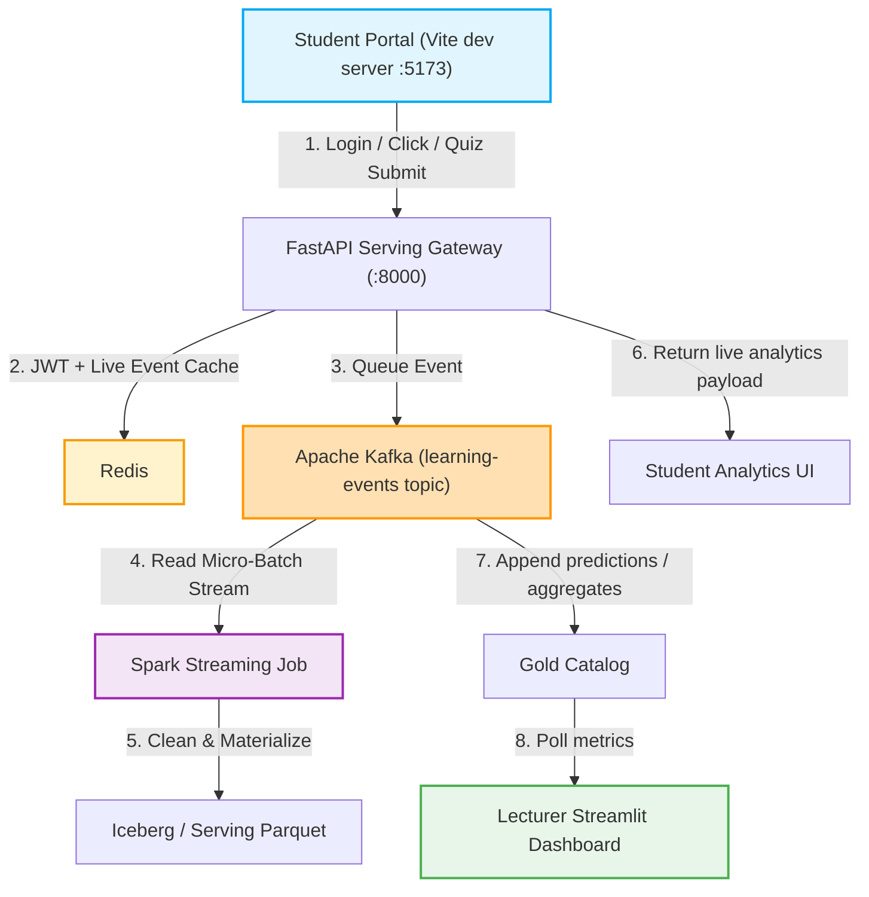

# B-Learn End-to-End Real-Time Closed-Loop Testing Guide

This guide describes how to start the local demo, verify the live clickstream / assessment loop, and confirm that the Analytics page is using real backend data rather than hardcoded mock values.

---

## 1. System Architecture Flow

The current demo flow is:



---

## 2. Prerequisites & Environment Setup

There are two supported ways to run the demo:

1. Local developer mode:
   - Frontend: `http://localhost:5173`
   - Backend gateway: `http://127.0.0.1:8000`
2. AKS / port-forward mode:
   - Frontend service: `http://localhost:8080`
   - Gateway service: `http://localhost:8000`

For day-to-day testing and code changes, use local developer mode. It is the fastest way to see React updates and live analytics changes.

> [!IMPORTANT]
> If you use the local backend, keep the gateway terminal running. If you use AKS port-forward, keep the `kubectl port-forward` terminal open or the browser will start showing `Failed to fetch`.

### Step 2.1: Wake Up Cluster & Deploy Infrastructure
If you want to test against AKS, run:
```bash
make demo-prep
make demo-connect
```

For local development, run the frontend and backend separately:
```bash
source .venv/bin/activate
python backend-api/serving_gateway.py

npm --prefix frontend-demo run dev
```

Then open:
- Frontend: `http://localhost:5173`
- Gateway health: `http://127.0.0.1:8000/health`
- Gateway docs: `http://127.0.0.1:8000/docs`

---

## 3. Step-by-Step E2E Testing Scenarios

### Step 3.1: Open the Right Windows
Recommended layout for the live demo:

1. **Window 1 - Student UI**
   - Local dev: `http://localhost:5173/courses/big-data-course/analytics`
   - AKS tunnel: `http://localhost:8080/courses/big-data-course/analytics`
2. **Window 2 - Gateway logs**
   - Local backend terminal running `python backend-api/serving_gateway.py`
3. **Window 3 - Optional event monitor**
   - `kubectl logs -f deployment/blearn-api-gateway -n blearn-medallion`
   - or `kubectl exec -it deployment/redis -n blearn-medallion -- redis-cli keys "*"`.

---

### Step 3.2: Scenario A - High Quiz Performance (Reduced Student Risk)

#### 1. Student Portal Action
- Login with the demo credentials: `quan@blearn.test` / `123456`.
- Go to the **Courses** page, select **Kỹ nghệ Dữ liệu lớn & Streaming**, then open **Analytics**.
- Navigate to **Assignments**, open a quiz, and submit a score `>= 50`.

#### 2. Expected Real-Time Reactions
- **Student UI**: The submission alert appears and the Analytics page starts updating from the live gateway response.
- **Gateway log**: You should see `POST /submit-assessment` followed by `GET /recommendations/{student_hash}`.
- **Student Analytics Page**:
  - `Tần suất hoạt động` should show a nonzero `weekly_minutes` after any click or submit event.
  - `Nguồn:` should switch to `live_event_log` after a live interaction.
  - Radar/BKT values should reflect the gateway response, not static placeholders.
- **Backend**: The `/recommendations/{student_hash}` payload should include:
  - `dropout_probability`
  - `bkt_mastery`
  - `activity_summary`
  - `recent_sessions`
  - `data_source.mode`

---

### Step 3.3: Scenario B - Low Quiz Performance (High Student Risk Warning)

#### 1. Student Portal Action
- Submit a low score or click a few materials first to create event-log changes.
- The analytics should update immediately after a refresh or page revisit.

#### 2. Expected Real-Time Reactions
- **Student Analytics Page**:
  - Risk / pass-rate should move according to the latest gateway response.
  - `Chi tiết phiên học gần đây` should change if you click a material or submit a quiz.
- **Gateway**:
  - If the token is stale, the frontend should auto-login again and retry.
  - If there are no live events yet, `data_source.mode` will show `seeded_cache`.

---

## 4. How to Confirm It Is Really Live

The easiest verification steps:

1. Open the Analytics page.
2. Click a material inside the course or submit a quiz.
3. Refresh the Analytics page.
4. Check the badge under the heatmap:
   - `live_event_log` means the gateway is serving live event data.
   - `seeded_cache` means you are still looking at initial fallback data.
5. For a direct backend check:
```bash
curl -s http://127.0.0.1:8000/health
curl -s -H "Authorization: Bearer <token>" http://127.0.0.1:8000/recommendations/<student_hash>
```

---

## 4. Resetting the Demo Environment

To run the demo repeatedly for different sessions, use the following targets:

### Option 1: Fast Reset (In-Memory Only)
This resets the student's prediction shifts in the FastAPI serving gateway back to baseline. Takes less than 2 seconds:
```bash
make demo-reset
```

### Option 2: Deep Reset (Database & Checkpoints)
This stops the streaming engine, truncates the Silver/Gold Iceberg tables on Azure ADLS Gen2, deletes Spark streaming checkpoint directories, and scales the streaming pods back up to start from scratch:
```bash
make demo-reset-deep
```

---

## 5. What Happens If You Stop AKS and Start It Again?

Stopping AKS is the right move when you want to save Azure credit between demo sessions. The important part is to distinguish between durable data and runtime state.

### What usually comes back

- Iceberg / ADLS data that was already materialized by the pipeline.
- The application deployments and services after `make aks-start` and `make streaming-resume`.
- The frontend and gateway once `make demo-connect` is run again.
- Fresh live analytics after you generate a new click or quiz submission.

### What does not survive

- Redis memory cache and any live event state that only existed in RAM.
- Gateway in-memory caches such as fast lookup dicts and recent live event buffers.
- Browser-side session state if you clear `localStorage` or the JWT expires.
- Anything you had only in a temporary demo session and never wrote to persistent storage.

### Recommended recovery flow after restart

1. Start the cluster again:
```bash
make aks-start
```
2. Bring the services back:
```bash
make streaming-resume
```
3. Recreate the tunnels:
```bash
make demo-connect
```
4. Open the Analytics page and trigger one new live action:
   - click a material, or
   - submit a quiz.
5. Confirm the badge under the heatmap:
   - `live_event_log` means the gateway is now serving fresh live data.
   - `seeded_cache` means you are still seeing fallback state and should trigger one more event.

### One-line demo rule

If you stop AKS to save credit, assume the platform will come back clean, but the live session state will not. Plan to re-warm the system with one new interaction before presenting the Analytics page.
