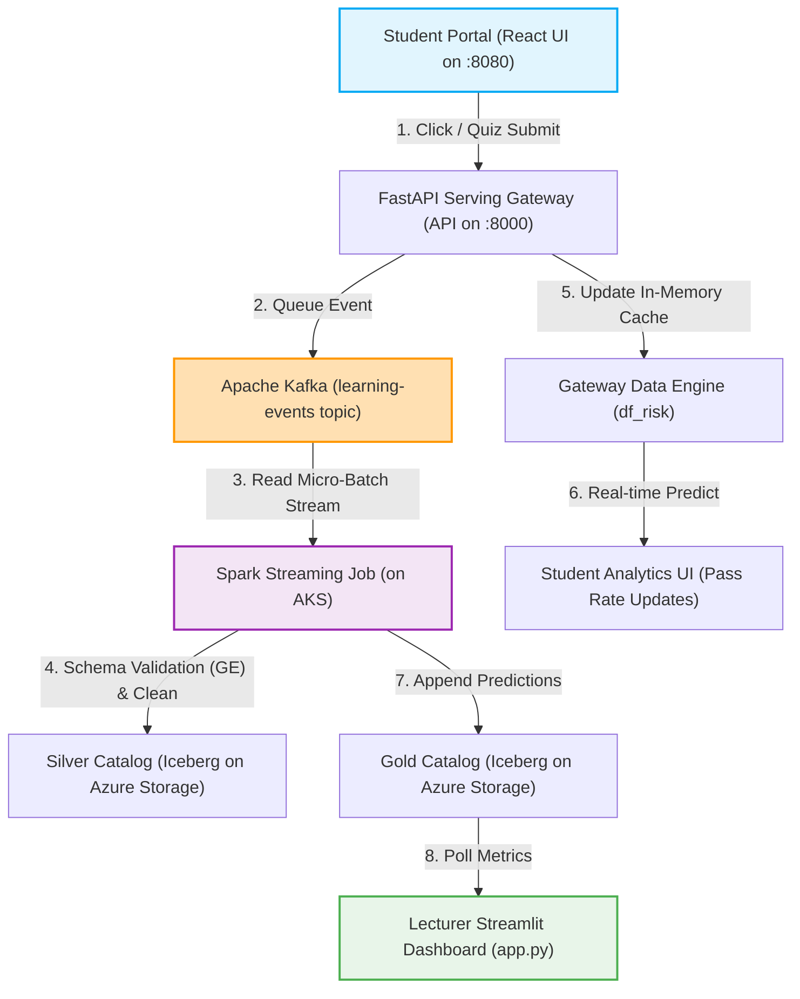

# B-Learn End-to-End Real-Time Closed-Loop Testing Guide

This guide describes the step-by-step procedure to test the live clickstream and assessment submission ingestion pipeline. It traces interactions from the student UI through Kafka and Spark Streaming, down to real-time analytics updates visible on both the Student Frontend and Lecturer Dashboard.

---

## 1. System Architecture Flow

The following Mermaid diagram visualizes the closed-loop real-time pipeline:



---

## 2. Prerequisites & Environment Setup

Before starting the test, ensure that the Azure AKS cluster resources are active, and local ports are forwarded.

> [!IMPORTANT]
> Ensure that port `5000` AirPlay Receiver is disabled in macOS Settings -> General -> AirPlay & Handoff, as it will conflict with MLflow local tracking. We port-forward MLflow to local port `5005` to prevent conflicts.

### Step 2.1: Wake Up Cluster & Deploy Infrastructure
In your local terminal, run the following commands:
```bash
# 1. Wake up virtual machines and scale replica groups
make demo-prep

# 2. Establish connection tunnels for all services
make demo-connect
```

### Step 2.2: Verify API Status & Health
Check the health status of active pods and endpoints:
```bash
# 1. Inspect cluster resource usage and pod readiness
make demo-status

# 2. Confirm FastAPI Gateway is active
curl -I http://localhost:8000/docs

# 3. Confirm MLflow Tracking Server is active
curl -I http://localhost:5005/
```

---

## 3. Step-by-Step E2E Testing Scenarios

### Step 3.1: Initialize the Multi-Window Demo Setup
Arrange three windows on your monitor:
1. **Window 1 (Student View)**: Open Chrome and navigate to `http://localhost:8080` (accessible via the secure port-forward tunnel to the AKS cluster).
2. **Window 2 (Kafka Monitor)**: In your terminal, run the following command to print the topic output in real-time:
   ```bash
   make kafka-consume-stream
   ```
3. **Window 3 (Lecturer View)**: Open the Lecturer Dashboard. You can access it:
   - **Directly on the Cloud**: Navigate to `http://135.171.193.190` (using the public LoadBalancer IP deployed on AKS).
   - **Via Local Tunnel**: Navigate to `http://localhost:8501` (if port-forwarded).

---

### Step 3.2: Scenario A - High Quiz Performance (Reduced Student Risk)

#### 1. Student Portal Action
- Login with the demo credentials: `quan@blearn.test` / `123456`.
- Go to the **Courses** page, select a course, and navigate to **Analytics**. Note the initial baseline prediction (default pass rate is around **85%**).
- Navigate to **Assignments**, click on the 20-question quiz, and click **Start**.
- Answer at least **15 questions correctly** (scoring 75%).
- Click **Submit Assignment**.

#### 2. Expected Real-Time Reactions
- **Student UI**: A success message callout appears with a green banner indicating low dropout risk.
- **Kafka Monitor Terminal**: A JSON payload containing `event_type: "assessment_submission"` with a `score >= 50` appears instantly:
  ```json
  {"effective_student_id":"...", "assignment_id":100, "score":75.0, "event_type":"assessment_submission"}
  ```
- **Student Analytics Page**: Navigate back to **Analytics**. The page auto-refreshes using `st.fragment` within 3 seconds, showing:
  - An updated `dropout_probability` (decreased).
  - An increased `passRate` (moving up from 85% to **~90%**).
- **Lecturer Dashboard**: The student risk assessment chart dynamically updates, showing the student hash falling into the "Low Risk" (Green) tier.

---

### Step 3.3: Scenario B - Low Quiz Performance (High Student Risk Warning)

#### 1. Student Portal Action
- Go back to the **Assignments** page, select the next quiz, and start the quiz.
- Deliberately select incorrect answers, scoring less than **5 questions correctly** (scoring under 25%).
- Click **Submit Assignment**.

#### 2. Expected Real-Time Reactions
- **Student UI**: A caution alert banner appears warning the student that their dropout risk has risen and suggesting supplementary materials.
- **Kafka Monitor Terminal**: A JSON payload containing `event_type: "assessment_submission"` with a `score < 50` appears:
  ```json
  {"effective_student_id":"...", "assignment_id":101, "score":20.0, "event_type":"assessment_submission"}
  ```
- **Student Analytics Page**: Note that the pass rate gauge and dropout risk indicators instantly transition:
  - An increased `dropout_probability`.
  - A decreased `passRate` (dropping down to **~75%**).
- **Lecturer Dashboard**: The student risk evaluation list is updated. An alert flashes on the lecturer dashboard showing the student hash moving into the "High Risk" (Red) tier, triggering SLA drift warning flags on the monitor grid.

---

## 4. Resetting the Demo Environment

To run the demo repeatedly for different sessions, use the following targets:

### Option 1: Fast Reset (In-Memory Only)
This resets the student's prediction shifts in the FastAPI serving gateway back to baseline. Takes less than 2 seconds:
```bash
make demo-reset
```

### Option 2: Deep Reset (Database & Checkpoints)
This stops the streaming engine, truncates the Silver/Gold Iceberg tables on Azure ADLS Gen2, deletes Spark streaming checkpoint directories, and scales the streaming pods back up to start from scratch:
```bash
make demo-reset-deep
```
